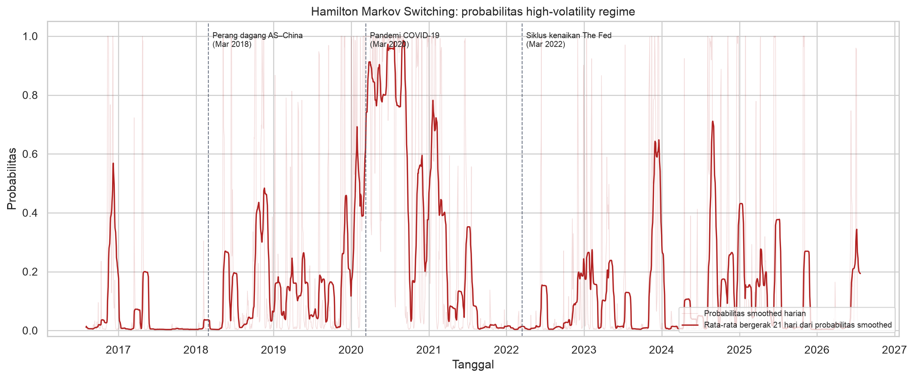
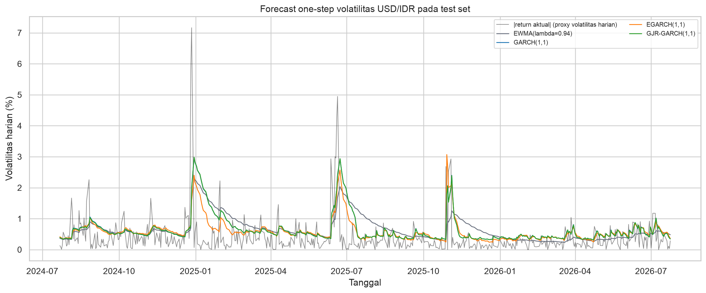

# USD/IDR Regime-Aware Volatility Forecasting

[](https://github.com/Daffamohammad/usd-idr-regime-volatility/actions/workflows/ci.yml)


> A reproducible econometrics case study: identify endogenous USD/IDR volatility regimes, forecast next-day variance, and separate that task from directional classification.

<p align="center">
  
</p>

This portfolio project asks three deliberately separate questions:

1. **When does USD/IDR enter a high-volatility regime?**
2. **Do GARCH-family models improve next-day variance forecasts over a simple EWMA benchmark?**
3. **How much directional accuracy is available from information known at the time?**

It is a learning and portfolio artefact—not a trading signal, investment recommendation, or causal claim about exchange-rate events.

## What I built

- A frozen and checksummed USD/IDR + US 10Y market-data snapshot, so the result can be reproduced without depending on a live download.
- A two-state Hamilton Markov-switching diagnostic that distinguishes **filtered** probabilities safe for prediction from **smoothed** probabilities used only for historical interpretation.
- Leakage-aware rolling one-step forecasts for EWMA, GARCH, EGARCH, and GJR-GARCH with periodic refitting.
- A separate logistic direction model with a persistence-sign baseline—because variance forecasting and return direction are different tasks.
- Reusable Python modules, unit tests, executed artefacts, a pinned lockfile, and CI checks.

## Executed result snapshot

The tracked Yahoo Finance snapshot covers **1 July 2016–24 July 2026** (2,618 price observations; 2,597 after feature construction). The final chronological test set contains 520 observations, beginning 22 July 2024. These values are generated from the tracked snapshot, not placeholders.

| Task | Model | Test-set result |
| --- | --- | ---: |
| Variance forecast | **GARCH(1,1)** | **Best QLIKE: −0.0405** |
| Variance forecast | EGARCH(1,1) | **Best variance MAE/RMSE: 0.7240 / 3.0380** |
| Variance forecast | GJR-GARCH(1,1) | QLIKE −0.0375 |
| Variance forecast | EWMA (λ = 0.94) | QLIKE 0.2342; MAE 0.8645; RMSE 3.1364 |
| Direction | Persistence-sign baseline | 49.23% accuracy |
| Direction | Logistic with lagged market, volatility, US10Y, and filtered-regime features | **54.04% accuracy** |

There is no single volatility winner: GARCH is preferred by QLIKE (lower is better), while EGARCH minimizes MAE/RMSE against squared return. Crucially, every GARCH-family specification outperforms the simple EWMA benchmark on all reported variance losses in this snapshot. That is evidence for this fixed sample—not a claim of universal superiority.

The directional lift is intentionally presented cautiously. A 54.04% accuracy result on 520 observations is not sufficient to claim a durable predictive edge; it is an exploratory classification result that should be stress-tested across rolling test windows before any practical use.

<p align="center">
  
</p>

## Methodology and information discipline

### Data

- `IDR=X`: IDR per USD from Yahoo Finance via `yfinance`.
- `^TNX`: US Treasury 10Y yield proxy. The last published value is carried forward only across dates where the US market is closed.
- [`data/raw/manifest.json`](data/raw/manifest.json) records ticker, retrieval time, coverage, and SHA-256 checksum.
- Optional Bank Indonesia Rate, inflation, and Indonesia 10Y yield inputs follow the documented [`available_date` / as-of rule](data/raw/README.md); no unverified ticker is substituted.

### Regime detection

`statsmodels.tsa.regime_switching.MarkovRegression` is fitted to daily log returns (%) with two states, state-specific intercepts, and `switching_variance=True`.

- High-volatility is labelled by the state with higher realised variance—not by its arbitrary model number.
- **Smoothed** probabilities use future observations and are restricted to retrospective charts.
- The direction model uses a **train-fitted filtered** probability, lagged one day, so the target-day return cannot leak into a predictor.
- Event annotations are plausibility context only; they are not causal evidence or model targets.

### Variance forecasting

All variance models use daily returns in percent and are evaluated one step ahead against squared return, a noisy realised-variance proxy:

- EWMA / RiskMetrics-style baseline with λ = 0.94;
- GARCH(1,1), EGARCH(1,1), and GJR-GARCH(1,1), each with Student-t innovations;
- GARCH-family parameters are refit every 63 observations using only information then available;
- MAE, RMSE, and QLIKE are reported together because each loss captures a different aspect of variance-forecast quality.

The directional classifier is explicitly a separate task. It uses a `StandardScaler` + logistic-regression pipeline with lagged returns, volatility, US10Y changes, and the lagged filtered regime probability. Its comparator is persistence of the prior return sign.

## Reproduce exactly

The canonical environment is Python 3.12 with [`pyproject.toml`](pyproject.toml) and the committed [`uv.lock`](uv.lock). Install [uv](https://docs.astral.sh/uv/) once, then run:

```bash
uv sync --locked
uv run pytest -q
MPLBACKEND=Agg uv run python -m src.forecasting
MPLBACKEND=Agg uv run python scripts/execute_notebook_inprocess.py notebooks/01_eda_and_regime_detection.ipynb
MPLBACKEND=Agg uv run python scripts/execute_notebook_inprocess.py notebooks/02_garch_forecasting.ipynb
```

The standard notebook route is also available:

```bash
MPLBACKEND=Agg uv run jupyter nbconvert --execute --to notebook --inplace notebooks/01_eda_and_regime_detection.ipynb
MPLBACKEND=Agg uv run jupyter nbconvert --execute --to notebook --inplace notebooks/02_garch_forecasting.ipynb
```

Notebook 02 reads the tracked snapshot rather than downloading data again. To reproduce the exact values in this repository, do not refresh `data/raw/yahoo_usd_idr_us10y.csv`. [`requirements.txt`](requirements.txt) remains as a simple `pip` fallback, while `uv.lock` is the reproducible source of truth. GitHub Actions runs the tests, full pipeline, and both notebooks on every pull request and push to `main`.

## Repository map

```text
data/
  raw/          # frozen Yahoo snapshot, checksum manifest, optional-macro contract
  processed/    # generated daily features
notebooks/      # EDA/regime diagnosis and forecasting walkthroughs
src/            # ingestion, features, Hamilton model, GARCH/EWMA, orchestration
tests/          # feature-availability and loss-function tests
outputs/        # metrics, predictions, and presentation-ready charts
.github/        # reproducibility CI
```

## Artefacts

- [Regime probability chart](outputs/regime_probability.png)
- [Volatility forecast chart](outputs/volatility_forecasts.png)
- [Variance forecast metrics](outputs/volatility_metrics.csv)
- [Direction metrics](outputs/direction_metrics.csv)
- [Variance forecasts](outputs/volatility_forecasts.csv)
- [Regime probabilities](outputs/regime_probabilities.csv)
- [EDA and regime-detection notebook](notebooks/01_eda_and_regime_detection.ipynb)
- [Forecasting notebook](notebooks/02_garch_forecasting.ipynb)

## Limitations

- Yahoo Finance is a practical course-project source, not Bank Indonesia’s official reference rate.
- Squared daily return is a highly noisy volatility proxy; realised intraday volatility or a longer horizon would be a stronger target.
- Optional macro series require publication-date discipline; using the economic reference month instead would create look-ahead bias.
- Event overlays show temporal coincidence, not causality.
- This single frozen holdout supports transparent comparison, but not an investable forecasting claim.

Method references: Hamilton (1989), “A New Approach to the Economic Analysis of Nonstationary Time Series and the Business Cycle”, *Econometrica*, 57(2), 357–384; [statsmodels MarkovRegression documentation](https://www.statsmodels.org/stable/generated/statsmodels.tsa.regime_switching.markov_regression.MarkovRegression.html); [arch forecasting documentation](https://arch.readthedocs.io/en/stable/univariate/forecasting.html).
